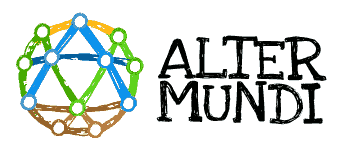
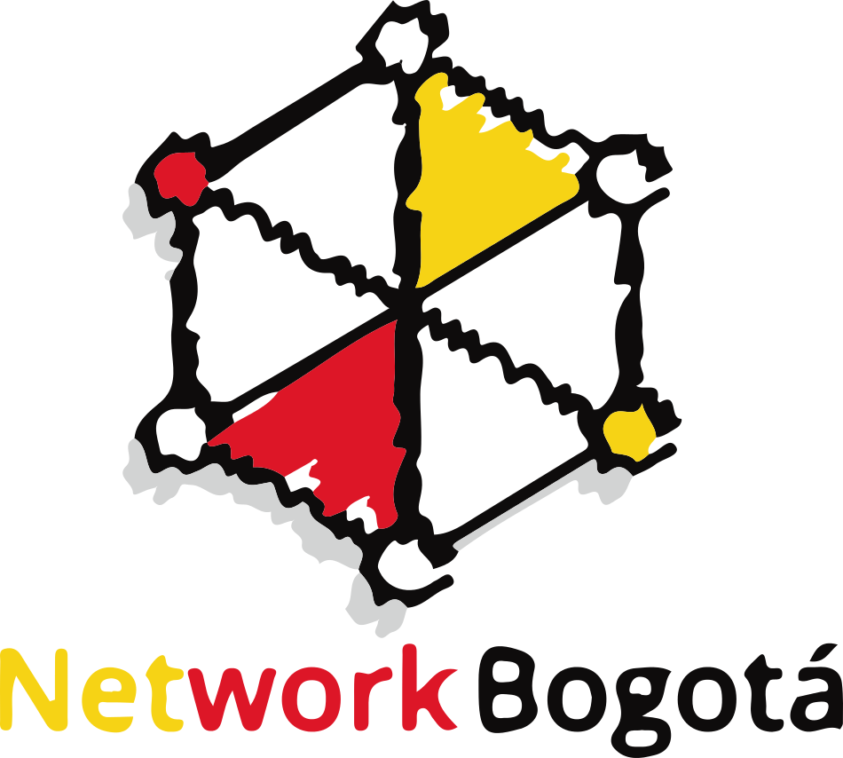

% Wifi Community Networks
% A grassroots approach to connectivity
% lusy

---

# Structure

* motivation
* how does it work?

---

(picture)

---

# Community Networks

* free, decentralised communication infrastructure set up and managed by its users
* free firmware
* free access to the network for everyone with a wifi capable device
* information is passed along without tampering or prioritising

---

## motivations?
* connect communities neglected by conventional Internet providers
* learn more about (wireless) networks
* teach more people about it (Bildungsauftrag :P)

so they:

* guarantee free access to information
* secure freedom of speech

---

## Some examples:
* Europe: Freifunk; Funkfeuer; Guifi; Ninux;
* US: nyc mesh
* Latin America: Altermundi; coolab; network bogota;

---

## Freifunk

* regular nodes (at home) and backbone nodes
* refugee shelters

---

# How does it work?

---

## network architectures / topologies

---

* wifi: line of sight
* uplink to the Internet (or a local offline network)

---

## self-developed firmware

* based on OpenWRT
* specific for the project
* generic ones: Gluon (https://gluon.readthedocs.io/en/v2017.1.x/), LibreMesh (https://libremesh.org/)

---

## Further reading

* Wlan für alle. Freie Funknetze in der Praxis (https://mabb.de/files/content/document/UEBER%20DIE%20MABB/Download-Center/Publikationen/Freifunk-Broschuere/freifunk-publikation-webversion-2-Auflage.pdf.pdf)
* Interview with Gui Irribaren from Altermundi (http://lateinamerika-nachrichten.de/?aaartikel=am-anfang-war-der-hackathon)
* Infoblatt Recht auf Kommunikation (https://www.npla.de/wordpress/wp-content/uploads/2017/01/Infoblatt_Recht_auf_Komunikation.pdf)

---

* Wireless Networks in the Developing World (http://wndw.net)

---

## Links

* [http://berlin.freifunk.net/participate/howto](http://berlin.freifunk.net/participate/howto)

---

# Thank you!

These slides are under the [by-sa Creative Commons License](https://creativecommons.org/licenses/by-sa/4.0/).

